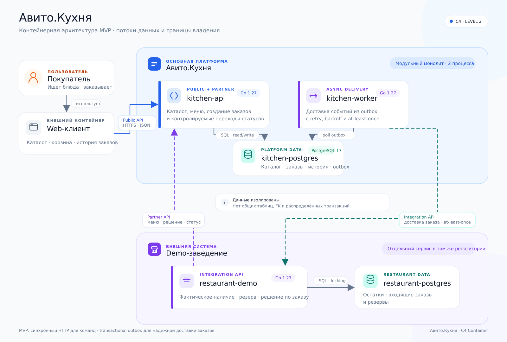
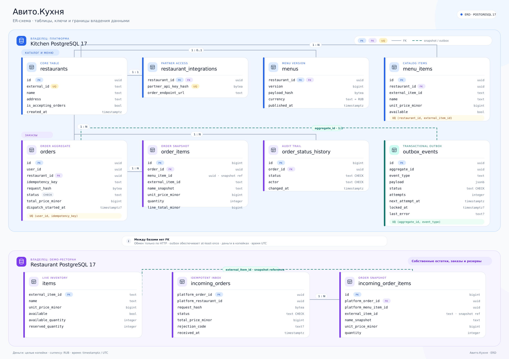
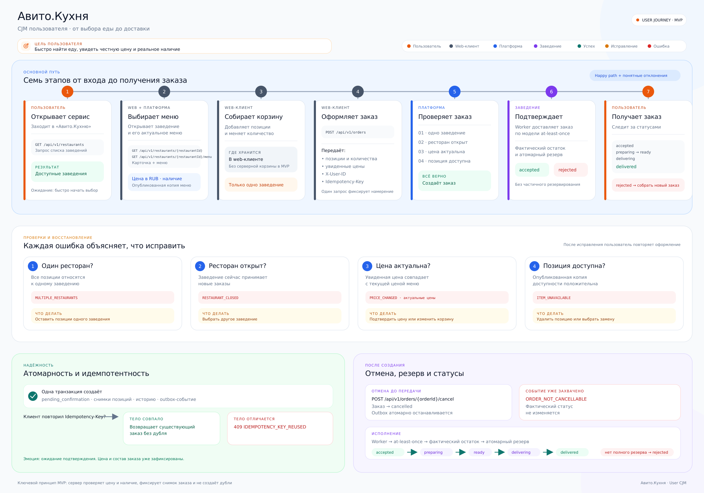
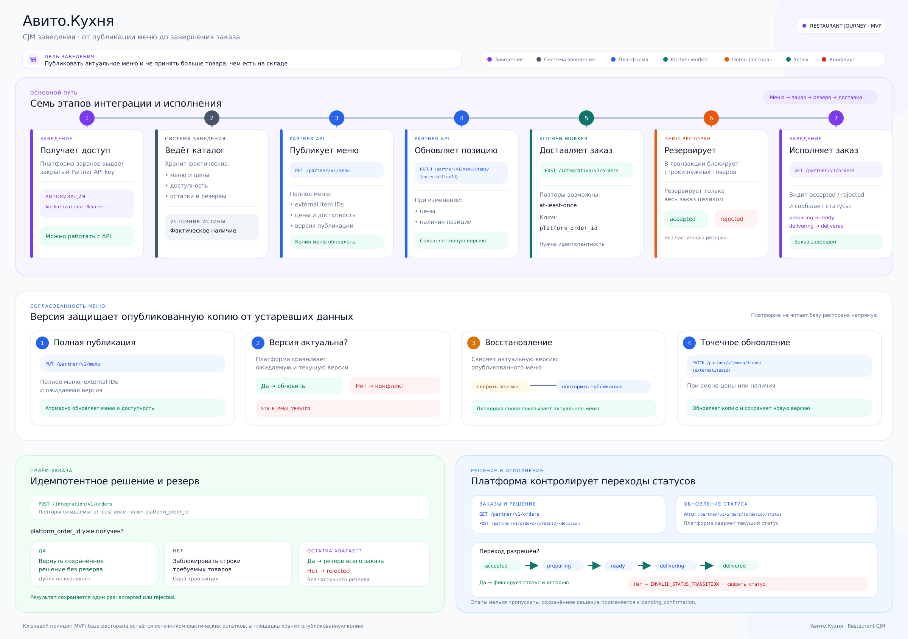
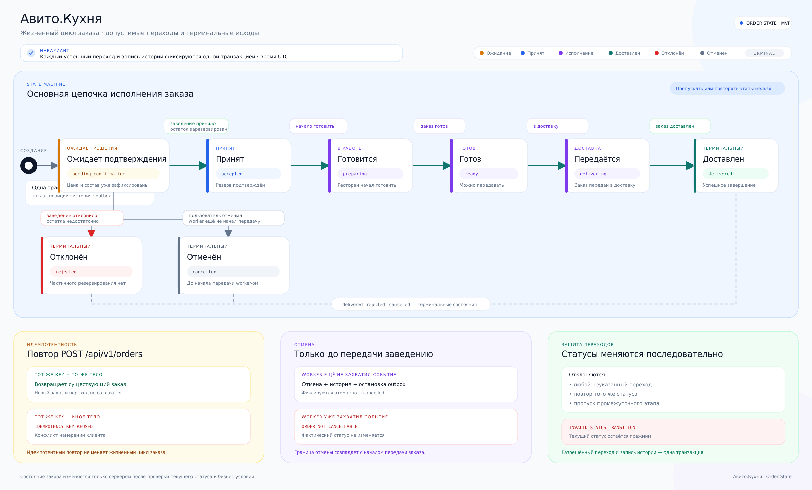
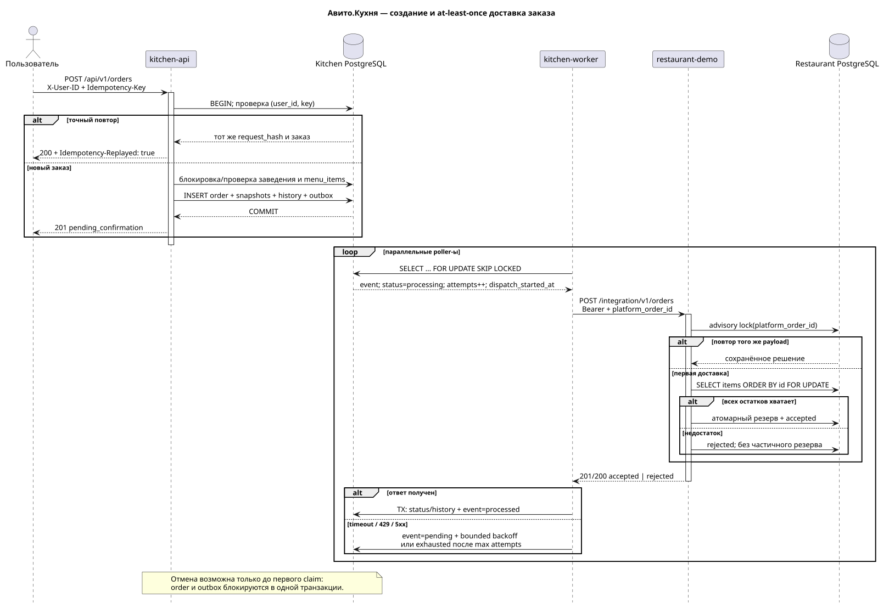

# Авито.Кухня

Учебный backend сервиса доставки еды. В проекте есть публичный каталог, оформление заказов,
закрытый API для заведений и отдельный demo-ресторан. Платформа и ресторан используют разные
базы PostgreSQL, а заказы передаются по HTTP с гарантией доставки at-least-once через
transactional outbox.

## Запуск и demo

Нужен Docker с Compose:

```shell
make up
```

Команда соберёт три Go-приложения, поднимет PostgreSQL 17, применит миграции и дождётся
готовности сервисов. После старта demo-ресторан публикует тестовое меню:

```shell
curl http://localhost:8080/api/v1/restaurants
curl http://localhost:8080/api/v1/restaurants/10000000-0000-4000-8000-000000000001/menu
```

Полный E2E-сценарий запускается так:

```shell
make e2e
```

Тест создаёт чистые volumes, публикует меню, доставляет заказ, проверяет повтор запроса с тем же
`Idempotency-Key`, проводит заказ до `delivered` и отдельно проверяет отказ при нехватке товара.
По умолчанию стенд и volumes удаляются после теста. Чтобы оставить их для просмотра:
`E2E_KEEP_STACK=1 make e2e`; остановка — `make down`.

| Компонент | Назначение | Порт |
|---|---|---:|
| `kitchen-api` | Public API, Partner API, health/readiness | 8080 |
| `kitchen-worker` | claim, HTTP delivery, retry, применение решения | — |
| `restaurant-demo` | Integration API, остатки и резерв | 8081 |
| `kitchen-postgres` | данные платформы | только Compose network |
| `restaurant-postgres` | данные demo-ресторана | только Compose network |

`kitchen-migrate` и `restaurant-migrate` — одноразовые goose-процессы. API не стартует до
успешной миграции.

## Архитектура и владение данными



Основная часть — модульный монолит: API и worker имеют общие use cases, но разные
entrypoints. Demo-ресторан — отдельный сервис. Прямых SQL-запросов в чужую БД нет.



Платформа владеет заведениями, опубликованной копией меню, заказами, историей и outbox.
Ресторан владеет остатками, резервами и входящими заказами. `order_items` хранит snapshots,
поэтому история не меняется вместе с меню.

Подробности: [архитектура](docs/architecture.md), [требования](docs/requirements.md),
[принятые решения](docs/decisions.md).

## CJM





## API и бизнес-правила

- [Kitchen OpenAPI 3.1](api/kitchen.openapi.yaml) — public, Partner, health/readiness;
- [Restaurant OpenAPI 3.1](api/restaurant.openapi.yaml) — Integration API;
- [пояснения к контрактам](docs/api.md).

Методы заказов требуют UUID в `X-User-ID`; это временная заглушка, а не аутентификация.
`POST /api/v1/orders` также требует `Idempotency-Key`. Partner/Integration API используют разные
Bearer keys; в Kitchen DB хранится только SHA-256 Partner key.

Деньги — целые копейки, валюта — `RUB`. Сервер перепроверяет цену и считает итог,
а ресторан повторно проверяет остаток.



`pending_confirmation → accepted|rejected|cancelled`, затем
`accepted → preparing → ready → delivering → delivered`. Отмена разрешена только до
первого claim outbox-события.

## Идемпотентность и надёжность



- Заказ, snapshots, история и outbox коммитятся в одной транзакции.
- Worker-ы конкурируют через `FOR UPDATE SKIP LOCKED`; HTTP не держит DB-транзакцию.
- Timeout, `429` и `5xx` повторяются с bounded backoff 1–32 секунды.
- После `WORKER_MAX_ATTEMPTS` событие остаётся `exhausted` с `attempts` и `last_error`.
- Demo сериализует `platform_order_id`, блокирует позиции в стабильном порядке и не делает
  частичный резерв.

Это at-least-once, а не exactly-once. Потерянный ответ приводит к безопасному повтору, а не
к повторному резерву.

## Конфигурация

Полный пример — [.env.example](.env.example). Все параметры читаются из environment variables:

- URL обеих БД, HTTP addresses и `KITCHEN_API_URL`;
- `DEMO_PARTNER_API_KEY`, `INTEGRATION_API_KEY`;
- poll interval, HTTP timeout, max attempts;
- HTTP read/write/idle/shutdown timeouts, body limit и `LOG_LEVEL`.

Значения `demo-*-change-me` — только локальные credentials; production-секретов в Git нет.

## Разработка и тесты

Нужны Go 1.27, PlantUML 1.2026.7, Docker и Compose.

```shell
make generate       # oapi-codegen v2.8.0
make diagrams       # PlantUML -> SVG
make test           # unit + httptest + Testcontainers PostgreSQL 17
make test-race
make vet
make lint           # golangci-lint v2
make vuln           # govulncheck
make compose-config
make check
```

`goose`, `oapi-codegen`, `golangci-lint` и `govulncheck` закреплены в `go.mod`. Сгенерированные
Go- и SVG-файлы вручную не редактируются. Интеграционные тесты проверяют миграции up/down/up,
ограничения базы, атомарность заказа и outbox, `SKIP LOCKED`, идемпотентный приём заказа и гонку
за последнюю единицу товара.

## Структура

```text
cmd/                     kitchen-api, kitchen-worker, restaurant-demo
api/                     OpenAPI 3.1 и configs генератора
internal/catalog/        каталог и меню
internal/orders/         заказы, snapshots, статусы, отмена
internal/partners/       Partner auth и версионное меню
internal/outbox/         claim, delivery, retry, completion
internal/restaurantdemo/ остатки, резерв и idempotent receiver
internal/generated/     generated HTTP models/interfaces/client
migrations/              независимые kitchen/restaurant goose-миграции
docs/                    требования, ADR, API, архитектура, PlantUML/SVG
tests/e2e.sh             сквозной Compose-сценарий
```

## Упрощения и масштабирование

- Web-клиент, backend-корзина, IdP, платежи, возвраты и курьерский домен вне scope.
- Demo использует один integration key. Для многих партнёров нужны secret manager и ротация.
- Нет admin endpoint для exhausted events: в production нужны alerting и управляемый replay.
- Publisher demo-меню на старте — детерминированный E2E bootstrap, а не production sync protocol.

Kafka/RabbitMQ, Redis и Kubernetes здесь не нужны. Брокер имеет смысл рассматривать
при трёх независимых потребителях/replay или если backlog нарушает p95 доставки 5 секунд;
Redis — после SQL tuning при p95 каталога >200 мс или DB CPU >70% 15 минут; Kubernetes — при
многоузловом production и autoscaling/self-healing.
