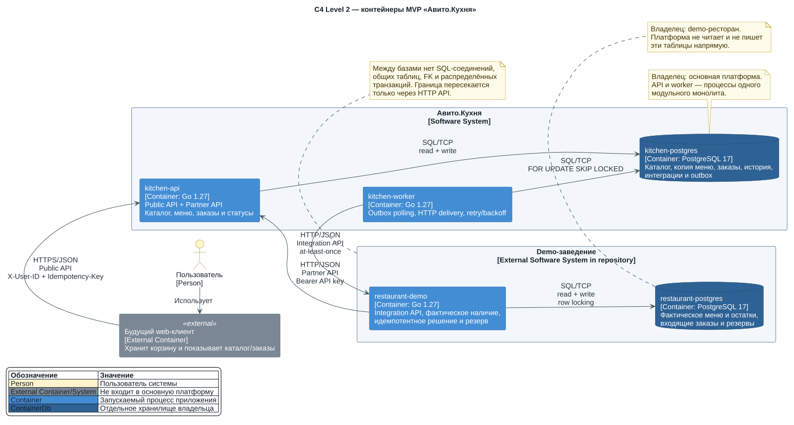

# Архитектура MVP «Авито.Кухня»

## C4 Container diagram

Диаграмма использует уровень C4 Container. Граница основной системы охватывает API, worker и
принадлежащую им базу. Будущий web-клиент показан снаружи, потому что в задании он не реализуется.
Demo-ресторан находится в том же Git-репозитории и Compose, но считается отдельной внешней
системой со своим API и хранилищем.

## Контейнеры

| Контейнер | Ответственность | Технология | Доступ к данным |
| --- | --- | --- | --- |
| Будущий web-клиент | Хранит корзину, показывает каталог и заказы, передаёт `X-User-ID` | Не реализуется в MVP | Только Public API |
| `kitchen-api` | Public и Partner API, проверки запросов, транзакции каталога и заказов, история статусов | Go 1.27, `net/http`, `chi/v5`, `pgxpool` | Только `kitchen-postgres` |
| `kitchen-worker` | Получение outbox через `SKIP LOCKED`, доставка заказов, retry/backoff, обработка устойчивого решения ресторана | Go 1.27, `pgxpool`, HTTP client | Только `kitchen-postgres` и Integration API ресторана |
| `kitchen-postgres` | Авторитетные данные платформы и transactional outbox | PostgreSQL 17 | API, worker и одноразовая kitchen-миграция |
| `restaurant-demo` | Фактическое меню и остатки, идемпотентный приём заказа, атомарный резерв, решение принять/отклонить | Go 1.27, `net/http`, `chi/v5`, `pgxpool` | Только `restaurant-postgres`; по HTTP — Partner API платформы |
| `restaurant-postgres` | Авторитетные данные demo-ресторана | PostgreSQL 17 | Demo-ресторан и одноразовая restaurant-миграция |

Одноразовые migration-контейнеры запускают закреплённый `goose` перед стартом зависимых процессов.
Они не являются постоянно работающими приложениями и обращаются каждый только к своей базе.

## Взаимодействия

1. Пользователь работает через будущий web-клиент. Тот вызывает Public API с `X-User-ID` и
   хранит корзину локально.
2. Система заведения публикует меню и меняет статусы через Partner API с Bearer API-ключом.
   В базе платформы находится только хеш ключа.
3. `kitchen-api` атомарно создаёт заказ, позиции, начальную историю и outbox-событие в
   `kitchen-postgres`.
4. `kitchen-worker` читает outbox и вызывает Integration API demo-ресторана. HTTP-доставка может
   повторяться, поэтому модель называется at-least-once.
5. `restaurant-demo` проверяет и резервирует собственные остатки в одной транзакции. Повторный
   `platform_order_id` возвращает сохранённое решение без повторного резерва.
6. Ответ ресторана или Partner API переводит заказ из `pending_confirmation` в `accepted` либо
   `rejected`; дальнейшие статусы также поступают через Partner API.

HTTP — единственный способ пересечь границу платформы и ресторана. Внутри платформы API и worker
могут использовать одну базу, потому что это два процесса одного модульного монолита, а не два
самостоятельно владеющих данными сервиса.

## Владение данными

| Данные | Владелец | Копия или связь в другой системе |
| --- | --- | --- |
| Карточки заведений | Платформа | Demo-ресторан знает выданный ему внешний/внутренний контекст интеграции |
| Partner API key hash и URL интеграции | Платформа | Исходный ключ передаётся demo-ресторану через окружение, но не сохраняется в Git |
| Опубликованные меню, цены и копия доступности | Платформа | Получены из фактического меню ресторана; могут быть временно неактуальны |
| Фактическое меню и остатки | Demo-ресторан | Платформа не изменяет и не читает эти таблицы напрямую |
| Пользовательские заказы и снимки позиций | Платформа | Demo хранит отдельный входящий заказ, связанный по `platform_order_id` |
| История статусов | Платформа | Demo хранит только нужное ему состояние входящего заказа |
| Outbox и попытки доставки | Платформа | Demo не имеет доступа к outbox |
| Входящие позиции и резервирование | Demo-ресторан | Платформа получает только устойчивое решение, а не управляет резервом |

Внешние ID всегда хранятся рядом с контекстом владельца. Они связывают системы на уровне HTTP,
но не заменяют внутренние UUID и не создают внешние ключи между базами.

## Инварианты границ

- `kitchen-api` и `kitchen-worker` не подключаются к `restaurant-postgres`.
- `restaurant-demo` не подключается к `kitchen-postgres`.
- Сервисы не создают распределённую транзакцию между базами.
- Отказ demo-ресторана не откатывает уже созданный заказ: outbox сохраняет событие для retry.
- Потерянный HTTP-ответ не приводит к повторному списанию остатка благодаря идемпотентности demo.
- Основной API может продолжать отдавать каталог и существующие заказы при временной
  недоступности ресторана; новые заказы остаются ожидающими до retry либо диагностики.
- Секреты и строки подключения передаются через environment variables, а базы доступны только
  тем контейнерам, которым они принадлежат.

## Масштабирование без смены модели

API и worker запускаются отдельными командами, поэтому их можно масштабировать независимо.
Несколько worker-ов безопасно делят outbox через `FOR UPDATE SKIP LOCKED`; несколько API-реплик
опираются на ограничения PostgreSQL для идемпотентности и переходов состояний.

На масштабе MVP PostgreSQL одновременно служит хранилищем и надёжной очередью outbox. Kafka,
Redis и Kubernetes не входят в контейнерную модель: критерии их появления зафиксированы в
`docs/decisions.md`, ADR-012.
